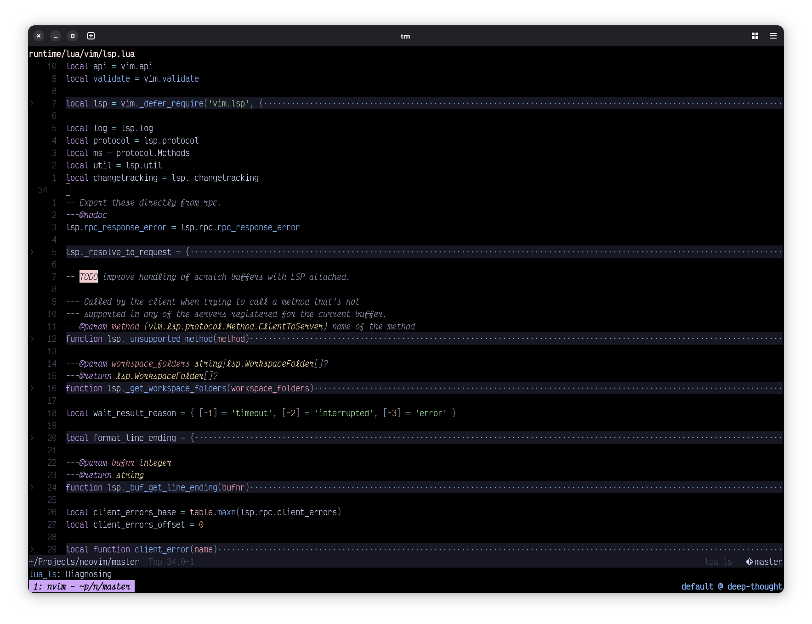

# dotfiles

Dotfiles for my terminal-based workflow.

## The Setup

Neovim in Zsh in WezTerm.

I also like using modern alternatives to common command-line tools like `ripgrep`,
`fd-find`, `lsd` and such.
