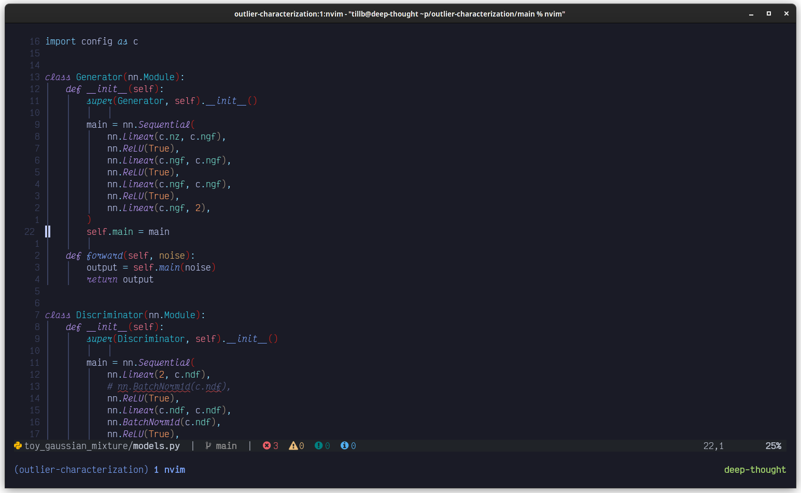

# dotfiles

Dotfiles for my terminal-based workflow.



## The Setup

Neovim in Zsh in Tmux in Kitty.

I also like using modern alternatives to common command-line tools like `ripgrep`,
`fd-find`, `lsd` and such.

## Install

### MacOS

- **First Time**

```bash
nix --extra-experimental-features "nix-command flakes" build ".#darwinConfigurations.e230-mb001.system"
```

- **From then on**

```bash
darwin-rebuild switch --flake ".#e230-mb001"
```

### Ubuntu

- **First Time**

In `/etc/nix/nix.conf` set

```nix
experimental-features = nix-command flakes
```

then run

```bash
nix build --no-link ".#homeConfigurations.linux.activationPackage"
"$(nix path-info .#homeConfigurations.linux.activationPackage)"/activate
```

- **From then on**

```bash
home-manager switch --flake '.#linux'
```

## Updating nix dependencies
```bash
nix flake update
```

## Notes

If gnome doesn't show the user by itself, set `systemUser = false` in `/var/lib/AccountsService/users/<user>`.
